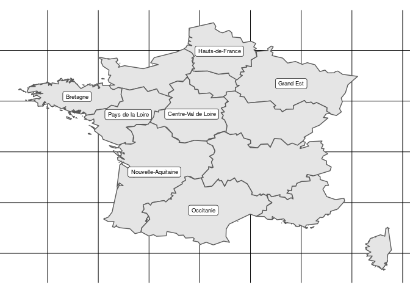

<!-- README.md is generated from README.Rmd. Please edit that file -->

# cartofr

The goal of cartofr is to provides a set of data to plot French
administrative system

## Installation

You can install the released version of cartofr from
[Github](https://github.com/denrou/cartofr) with:

``` r
remotes::install_github("denrou", "cartofr")
```

## Data

To get data from the package, just use:

``` r
data("cartofr")
```

`cartofr` is a list of 4 datasets in a `sf` format (links provide the
source of the
    dataset):

  - [country](https://data.opendatasoft.com/explore/dataset/countries-codes@public/information/?lang=fr)
    The external border of
    France.
  - [region](https://data.opendatasoft.com/explore/dataset/regions-francaises-openstreetmap@public/information/?lang=fr)
    The name and code of French
    regions.
  - [dept](https://data.opendatasoft.com/explore/dataset/geoflar-departements-2015@public/information/?lang=fr)
    The name and code of French
    departments.
  - [insee](https://data.opendatasoft.com/explore/dataset/code-postal-code-insee-2015@public/information/?lang=fr)
    The name and code of French towns.

## Plots

This package doesn’t provide any plot functions, but since objects are
`sf`, it is pretty straigtforward to plot them either using `ggplot2` or
`leaflet`.

``` r
# Using ggplot2
library(ggplot2)
library(sf)
#> Linking to GEOS 3.6.1, GDAL 2.3.2, PROJ 4.9.3
ggplot() + 
  geom_sf(data = cartofr[["region"]]) + 
  geom_sf_label(aes(label = name_fr), data = suppressWarnings(st_centroid(cartofr[["region"]])), size = 2.5) + 
  theme_void()
#> Warning: Removed 6 rows containing missing values (geom_label).
```



``` r
# Using leaflet
library(leaflet)
cartofr[["dept"]] %>% 
  leaflet() %>%
  addProviderTiles("CartoDB.Positron") %>% 
  addPolygons(label = ~name_fr, color = "gray", opacity = 1, fillOpacity = 0, weight = 2)
```
